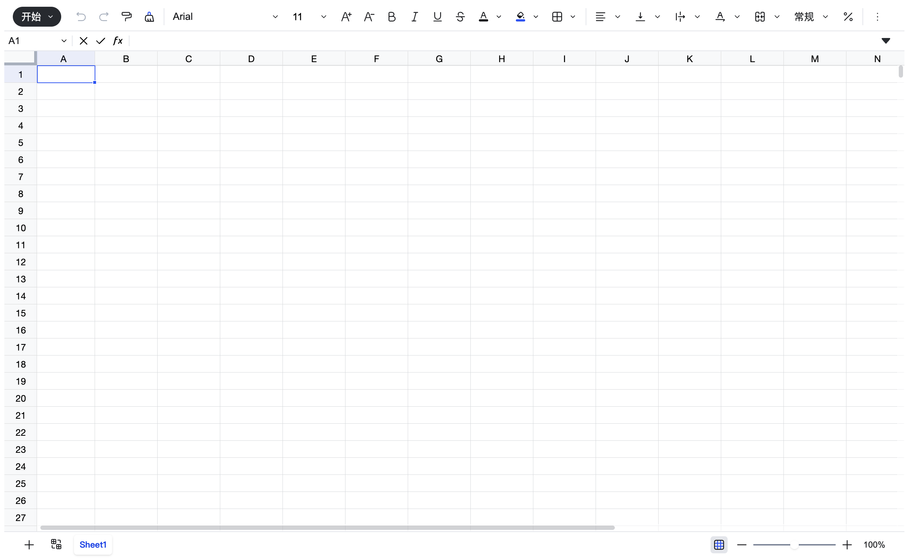

## 安装依赖
```package.json
"@univerjs/core": "^0.12.2",
"@univerjs/preset-sheets-core": "^0.12.2",
"@univerjs/presets": "^0.12.2",
```
## 初始化表格
```vue
<script lang="ts" setup>
  import type { FUniver } from '@univerjs/core/facade';
  import { UniverSheetsCorePreset } from '@univerjs/preset-sheets-core';
  import UniverPresetSheetsCoreZhCn from '@univerjs/preset-sheets-core/locales/zh-CN';

  import {
    createUniver,
    defaultTheme,
    LocaleType,
    merge
  } from '@univerjs/presets';
  import { onBeforeUnmount, onMounted } from 'vue';
  import '@univerjs/presets/lib/styles/preset-sheets-core.css';

  let univerAPIInstance: FUniver | null = null;

  onMounted(() => {
    const { univerAPI } = createUniver({
      locale: LocaleType.EN_US,
      locales: {
        enUS: merge({}, UniverPresetSheetsCoreZhCn)
      },
      theme: defaultTheme,
      presets: [
        UniverSheetsCorePreset({
          container: 'univer'
        })
      ]
    });

    univerAPI.createWorkbook({ name: 'My first workbook' });

    univerAPIInstance = univerAPI;
  });

  onBeforeUnmount(() => {
    univerAPIInstance?.dispose();
    univerAPIInstance = null;
  });
</script>

<template>
  <div id="univer" />
</template>

<style>
#univer {
  height: calc(100vh - 16px);
  overflow: hidden;
}
</style>
```

## 运行效果


## 常用api
```javascript
// 获取quan
const fWorkbook = univerAPI.getActiveWorkbook()
const fWorksheet = fWorkbook.getActiveSheet()
// 获取名称是 Sheet1 的工作表的 A1:B2 范围
const fRange = fWorksheet.getRange('Sheet1!A1:B2')
console.log(fRange, fRange.getA1Notation())
console.log(fRange.getValues()) // 范围所有单元格值
fRange.setValues([
    [1, 2],
    [3, 4], 
]).setFontWeight('bold').setFontLine('underline').setFontFamily('Arial').setFontSize(24).setFontColor('red')


// 单元格点击事件
univerAPI.addEvent(univerAPI.Event.CellClicked, (params) => {
  const { worksheet, workbook, row, column } = params
  console.log('点击的单元格:', worksheet.getRange(row, column).getA1Notation())
})


// 数据保存和恢复
const snapshot = fWorkbook.save()
const data = JSON.stringify(snapshot)
localStorage.setItem('sheet', data)
// 恢复数据
univerAPI.createUniverSheet(JSON.parse(localStorage.getItem('sheet')))
```
